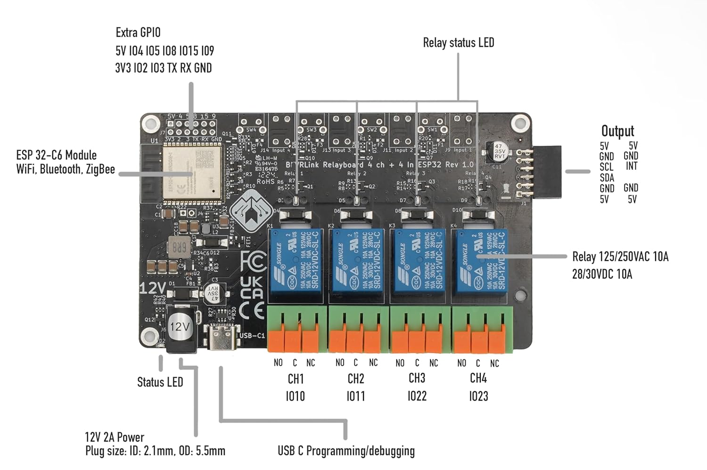

# ESPHome Predator 3500 Generator Controller

This project provides an ESPHome-based controller for automating the start-up and monitoring of a Predator 3500 generator. The controller is designed to actuate the choke, activate the starter for a configurable duration, and monitor generator output using a light sensor placed on the output indicator light.

## Features

- **Choke Actuation:** Automatically controls the generator's choke during start-up.
- **Starter Activation:** Engages the starter for a settable time period to ensure reliable engine start.
- **Output Monitoring:** Uses a light sensor to detect the generator's output status via the output indicator light.
- **Configurable Parameters:** Starter activation time and other settings can be adjusted via ESPHome configuration.
- **Remote Control & Monitoring:** Integrates with Home Assistant for remote operation and status updates.
- **Remote Web Monitoring** No Home assistant required. If used without home assitant disable API in code

## Hardware Requirements

- ESP8266 or ESP32 microcontroller (This project was created on a BEVR 4 Channel ESP32C6 development board)
- RF Remote with reciever (This project used a reciever with Logic level outputs RX480-E4 and corresponding remote). 
- Predator 3500 generator
- Actuator for choke control (12V car door 2 wire solenoid)
- Photo Resistor positioned on the generator's output light
- Power supply for ESP device

## Setup

1. Connect the choke and starter actuators to the ESP device via relays.
2. Mount the light sensor on the generator's output indicator light.
3. Wire Photodiode to the appropriate GPIO
4. Wire the RF Reciever to the Appropriate GPIO points
4. Flash the ESP device with the provided ESPHome configuration.
5. Integrate with Home Assistant for remote control and monitoring.

## Configuration

All operational parameters (such as starter activation time) can be set in the ESPHome YAML file. Adjust these values to match your generator's requirements.

## Safety Notice

Ensure all wiring and modifications are performed safely and in accordance with the generator's manual. Improper installation may result in equipment damage or personal injury.

## License

This project is open source under the MIT License.